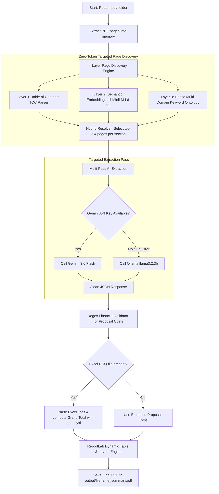

# 📑 Universal AI Tender & Proposal Document Analyzer

> **Universal 4-Layer Discovery Engine + Verbatim Grid Table Extraction + Commercial Regex Guard + ReportLab PDF Generator**

An intelligent, token-efficient AI pipeline designed to parse, extract, and analyze Government and Enterprise **Tender / RFP Proposals** (PDF) and commercial **Bill of Quantities / BOQ** spreadsheets (`.xlsx` / `.xls`).

---

## 🌟 Key Features

- **🚀 4-Layer Zero-Token Discovery Engine**:
  - **Layer 1 (TOC Parser)**: Reads pages 1–6 to extract Table of Contents and mapped page numbers.
  - **Layer 2 (Semantic Vector Search)**: Local offline cosine similarity search via `sentence-transformers` (`all-MiniLM-L6-v2`).
  - **Layer 3 (Domain Keyword Ontology)**: Dense IT & technical keywords with 10x financial weight multipliers.
  - **Layer 4 (Hybrid Resolver)**: Blends, deduplicates, and limits extraction targets to the top 2–4 pages per topic—**reducing LLM token consumption by 80% to 95%!**

- **🤖 Dual LLM Inference Engine**:
  - **Primary**: Google **Gemini 3.6 Flash** (Structured JSON output mode, `temperature=0.0`).
  - **Offline Fallback**: Local **Ollama** (`llama3.2:3b` with 16k context window).

- **📊 100% Dynamic Grid Table Extraction**:
  - Automatically captures source table headers verbatim.
  - Dynamically calculates proportional column widths for 2, 3, 4, 5, and 6+ column tables.

- **💰 Deterministic Commercial Accuracy**:
  - **Regex Safety Guard**: Scans text for Grand Total, Subtotal, 18% GST, and Amount in Words to prevent AI hallucination.
  - **Excel BOQ Parser**: Direct spreadsheet reading with `openpyxl` for guaranteed mathematical precision.

- **📄 Executive PDF Report Generation**:
  - Generates polished, executive-ready PDF summaries in the `output/` directory using ReportLab Platypus.

---

## 🏗 Architecture Workflow



---

## 📂 Project Structure

```text
AI DocumentTender Analyze/
├── input/                  # Place input PDF proposals and Excel BOQ files here
├── output/                 # Generated executive PDF summary reports
├── .env                    # Environment variables (GEMINI_API_KEY)
├── .gitignore              # Git ignored files (venv, output, cache, .env)
├── tender_analyzer.py      # Main Universal AI Analyzer script
├── EXPLANATION.txt         # Detailed technical explanation document
└── README.md               # Project documentation
```

---

## ⚙️ Installation & Prerequisites

### 1. Clone or Open Workspace
Ensure Python **3.9+** is installed on your system.

### 2. Install Required Dependencies
Install the required packages:

```bash
pip install google-genai ollama PyMuPDF pypdf fastembed sentence-transformers numpy openpyxl reportlab
```

*(Note: PyMuPDF or pypdf can be used for PDF parsing. sentence-transformers runs locally on CPU/GPU).*

---

## 🔑 Environment Configuration

Create a `.env` file in the root directory:

```env
GEMINI_API_KEY=your_google_gemini_api_key_here
```

> **Note**: If `GEMINI_API_KEY` is not provided or fails, the application automatically switches to **Ollama** (`llama3.2:3b`). Ensure Ollama is running locally if you want offline extraction.

---

## 🚀 How to Run

### Method 1: Automatic Batch Mode (Recommended)
1. Place your tender PDF file(s) and any matching Excel BOQ file(s) into the `input/` folder.
2. Run:
```bash
python tender_analyzer.py
```
The script will automatically discover all PDFs, link corresponding Excel sheets, and produce PDF reports in `output/`.

---

### Method 2: Single-File CLI Execution
Specify an explicit PDF and optional Excel BOQ spreadsheet:

```bash
python tender_analyzer.py input/tender_proposal.pdf --excel input/boq_pricing.xlsx
```

---

## 📋 9 Core Extraction Sections

The analyzer extracts and formats the following 9 sections:

| # | Section | Description |
|---|---|---|
| **1** | **Executive Summary & Fact Sheet** | Project title, client/authority, dates, duration, scope overview |
| **2** | **Timeline & Milestones** | Phases, key activities, indicative period, deliverables |
| **3** | **Technical Approach & Architecture** | Layer/component, proposed tech stack, rationale/specification |
| **4** | **Team Composition** | Role profiles, experience ranges, key responsibilities |
| **5** | **Deliverables & Payment Tranches** | Milestone schedule, delivery outputs, payment percentages |
| **6** | **Commercial Proposal / BOQ** | Subtotal, 18% GST, Grand Total, and Amount in Words |
| **7** | **Annexures & Checklists** | Required documents, certificates, and compliance declarations |
| **8** | **Similar Projects & Past Experience** | Threshold values, qualifying criteria, marks allocated |
| **9** | **Presentation & Demonstration** | Demo requirements, scoring parameters, QCBS cutoff marks |

---

## 🛡️ License

This project is licensed under the MIT License.
